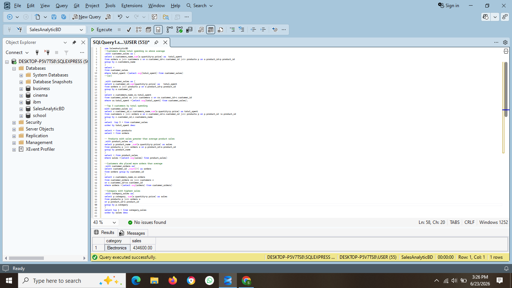

# SQL Sales Analysis Project

## Overview

This project demonstrates end-to-end sales analysis using SQL Server. The objective is to analyze customer behavior, product performance, and sales trends by solving real-world business problems through SQL queries.

The project demonstrates SQL skills ranging from fundamental concepts to advanced analytical techniques, including joins, subqueries, Common Table Expressions (CTEs), Window Functions, and business case study analysis.

## Project Highlights

- Built a relational sales database using SQL Server
- Performed customer, product, and revenue analysis
- Solved real-world business case studies using SQL
- Implemented advanced SQL concepts including CTEs and Window Functions
- Created a structured SQL portfolio project with documented results

## Database Schema

The project is built using three relational tables:

```text
Customers
├── customer_id (PK)
├── customer_name
└── city

Orders
├── order_id (PK)
├── customer_id (FK)
├── product_id (FK)
├── quantity
└── order_date

Products
├── product_id (PK)
├── product_name
├── category
└── price
```

### Relationships

```text
Customers (1) ─────< Orders >───── (1) Products
```
### Customers

Contains customer information and identifiers.

### Products

Contains product details, categories, and pricing information.

### Orders

Contains order transactions, quantities purchased, and customer-product relationships.

---

## SQL Concepts Implemented

* Basic SQL Queries
* Aggregate Functions
* GROUP BY and HAVING
* INNER JOIN and LEFT JOIN
* Subqueries
* Common Table Expressions (CTEs)
* Window Functions
* Business Case Study Queries

---

## Project Structure

| File                      | Description                          |
| ------------------------- | ------------------------------------ |
| table creation.sql        | Database and table creation scripts  |
| data insertion.sql        | Sample data insertion scripts        |
| 01.basic_queries.sql      | Basic SQL query examples             |
| 02.groupby_queries.sql    | Aggregation and grouping queries     |
| 03.join_queries.sql       | Join-based queries                   |
| 04.subqueries.sql         | Subquery examples                    |
| 05.cte.sql                | Common Table Expression examples     |
| 06.window_function.sql    | Window Function examples             |
| 07.case_study_queries.sql | Real-world business analysis queries |

---

## Business Problems Solved

* Identify top customers by revenue
* Find best-selling products
* Analyze category-wise sales performance
* Detect products that were never sold
* Identify customers who never placed orders
* Find customers spending above average
* Analyze products generating above-average sales
* Determine top-performing categories
* Evaluate customer order behavior
* Generate sales performance insights

---

## Key Skills Demonstrated

* Data Retrieval and Filtering
* Aggregation and Grouping
* Multi-table Joins
* Business-Oriented Query Writing
* Analytical Problem Solving
* Ranking and Window Functions
* Revenue and Customer Analysis
* SQL-Based Reporting

---

## Tools Used

* SQL Server
* SQL Server Management Studio (SSMS)
* GitHub

---

## Screenshots

Screenshots demonstrating query execution and results are available in the 'screenshots' folder.

## Sample Outputs

### Top 5 Customers by Revenue


### Products Never Sold


### Category with Highest Sales



---
## Learning Outcomes

Through this project, I gained hands-on experience in:

* Writing efficient SQL queries
* Working with relational databases
* Solving business problems using SQL
* Implementing CTEs and Window Functions
* Performing customer, product, and revenue analysis
* Building a structured SQL portfolio project

---

## Author

**Suram Rohit**

Aspiring Data Analyst passionate about SQL, Data Analysis, and Business Intelligence.
